# Курсовая работа. Tarkov Companion.

## Введение 

### Цели работы <a name="Цели_работы"></a>

Систематизация и углубление полученных знаний, самостоятельное изучение избранных вопросов и применение их на практике.

### Программа работы

1.	Выбор способа реализации курсовой работы
2.	Написание и согласование технического задания по курсовой работе с подробным описанием реализуемой функциональности
3.	Реализация всей требуемой функциональности
4.	Тестирование корректности работы
5.	Демонстрация результатов преподавателю
6.	Оформление отчета по курсовой работе


## Задание

### Постановка задачи

Разработать мобильное приложение на платформе Android, которое позволит управлять убежищем с мобильного устройства, не запуская игру на персональном компьютере: покупать у торговцев вещи, продавать торговцам вещи, улучшать постройки в убежище игрока.

### Возможности приложения

Возможные сценарии работы приложения.

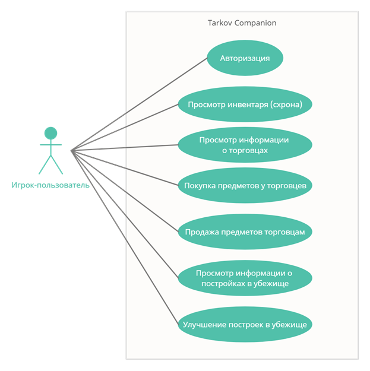


Сценарии работы приложения

1.	Авторизация: 

Пользователь авторизовывается в системе при помощи логина и получает доступ к информации на своём аккаунте: инвентарь, торговцы, убежище

2.	Просмотр инвентаря (схрона)

Пользователь может просматривать все предметы в своем инвентаре и количество денег в инвентаре.

3.	Просмотр информации о торговцах

Пользователь может просматривать информацию о торговцах: имя, уровень, показатель развитых отношений с торговцем, предметы торговца для дальнейшей покупки.

4.	Покупка предметов у торговцев

Пользователь может покупать предметы у торговцев.

5.	Продажа предметов торговцам

Пользователь может продавать предметы из своего инвентаря торговцам.

6.	Просмотр информации о постройках в убежище

Пользователь может просматривать информацию о постройках в своём убежище: название, уровень, текущие бонусы от постройки, требования, нужные для улучшения постройки

7.	Улучшение построек в убежище

Пользователь может улучшать постройки в своем убежище при достижении всех нужных требований.

## Реализация функциональности

### Структурная схема базы данных

Для начала нужно создать структуру базы данных для приложения. В ней будет хранится вся нужная информация о всех пользователях. Схема взята из Лабораторной работы №1.

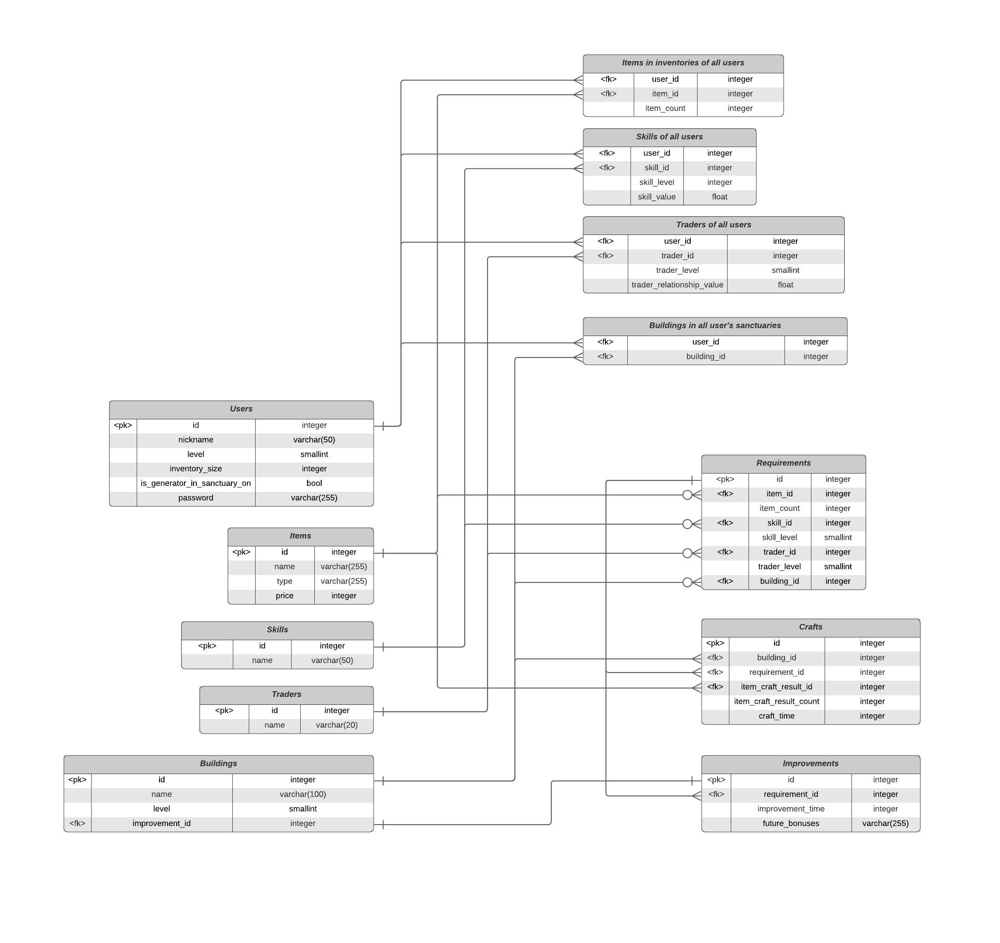

### Генерация тестовых данных

Алгоритмы генерации тестовых данных взяты из Лабораторной работы №2.

### Мобильное приложение

Для реализации мобильного приложения использован ЯП Kotlin. Для подключения к приложению базы данных использован плагин JDBC.

#### Подключение к базе данных

При запуске приложения, первым делом, идет соединение с базой данных. Я написал класс [Database](res/src/Database.kt) в котором хранятся все нужные запросы к базе данных. В этом классе я реализовал метод `connect()` для подключения к базе данных.

Также я создал класс [Resources](res/src/Resources.kt), в котором хранятся все константы и общие методы (например, для кэширования).

`Database.connect`
```kotlin
class Database {
    companion object {

        …

        lateinit var connection : Connection

        public fun connect() {
            connection = DriverManager.getConnection(
                    "jdbc:postgresql://${dbHOST}:${dbPORT}/Tarkov_DB",
                    dbUSER,
                    dbPASSWORD
            )
        }

        …
   }
}
```

#### Авторизация

Затем пользователя встречает стартовый экран авторизации.
Здесь он может ввести логин и пароль своего профиля и нажать на кнопку «ВОЙТИ».

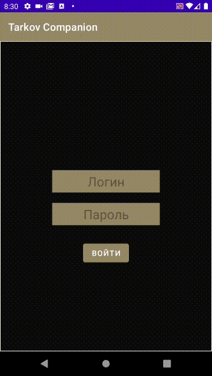

После нажатия на кнопку «ВОЙТИ» выполняется запрос к базе данных и с помощью метода `Database.userAuthorize()` введенный никнейм ищется в таблице `tarkov_db.users`. Если никнейм найден, дальше проверяется пароль: достается хэш-сумма пароля из столбца `users.password` и проверяется с помощью метода `Resources.isPasswordValid()`

`Database.userAuthorize()`
```kotlin
        public fun userAuthorize(nickname : String, password : String, view : View) = runBlocking {
            CoroutineScope(Dispatchers.IO).launch {
                var result = Database.connection.createStatement().executeQuery(
                        "SELECT id, password from users WHERE nickname = '$nickname'")
                if (result == null)
                    CoroutineScope(Dispatchers.Main).launch {
                        Toast.makeText(Resources.CURRENT_ACTIVITY, "Нет cоединения с БД.", Toast.LENGTH_SHORT).show()
                    }

                if (result.next()) {

                    val passwordHash = result.getString(2)
                    if (Resources.isPasswordValid(password, passwordHash)) {

                        CoroutineScope(Dispatchers.Main).launch {
                            Toast.makeText(
                                Resources.CURRENT_ACTIVITY,
                                "Пользователь найден!",
                                Toast.LENGTH_SHORT
                            )
                                .show()

                        }
                        result = Database.connection.createStatement().executeQuery(
                            "SELECT * from users WHERE nickname = '$nickname'"
                        )
                        result.next()

                        //getting user's info from database (from table 'users')
                        Resources.CURRENT_USER_ID = result.getInt(1)
                        Resources.CURRENT_USER_NICKNAME = result.getString(2)
                        Resources.CURRENT_USER_LEVEL = result.getInt(3)
                        Resources.CURRENT_USER_INVENTORY_SIZE = result.getInt(4)
                        Resources.CURRENT_USER_PASSWORD = result.getString(6)

                        result = Database.connection.createStatement().executeQuery(
                            "SELECT items.name, item_count FROM items_in_inventories_of_all_users\n" +
                                    "INNER JOIN items  on items.id = items_in_inventories_of_all_users.item_id\n" +
                                    "WHERE user_id = ${Resources.CURRENT_USER_ID} and type = 'деньги'"
                        )

                        while (result.next()) {
                            when (result.getString(1)) {
                                "Рубли" -> Resources.CURRENT_USER_RUBLES_COUNT = result.getInt(2)
                                "Доллары" -> Resources.CURRENT_USER_DOLLARS_COUNT = result.getInt(2)
                                "Евро" -> Resources.CURRENT_USER_EUROS_COUNT = result.getInt(2)
                            }
                        }

                        Navigation.findNavController(view).navigate(
                            R.id.action_authorizeScreenFragment_to_mainMenuFragment
                        )
                    }
                    else {
                        CoroutineScope(Dispatchers.Main).launch {
                            Toast.makeText(Resources.CURRENT_ACTIVITY, "Неверный пароль.", Toast.LENGTH_SHORT).show()
                        }
                    }
                }
                else {
                    CoroutineScope(Dispatchers.Main).launch {
                        Toast.makeText(Resources.CURRENT_ACTIVITY, "Пользователь не найден.", Toast.LENGTH_SHORT).show()
                    }
                }

                result.close()
            }.join()
        }
```

`Resources.isPasswordValid()`, используя библиотеку [JBCrypt](https://www.mindrot.org/projects/jBCrypt/),  расшифровывает хэш-сумму и сравнивает результат с введенным паролем.

`Resources.isPasswordValid()`
```kotlin
        public fun isPasswordValid(password: String, hash : String) : Boolean {
            return BCrypt.checkpw(password, hash)
        }
```


Если никнейм пользователя не найден, то на экране выскакивает сообщение «Пользователь не найден.»

Если пароль пользователя не верен, то на экране выскакивает сообщение «Неверный пароль.»

Если никнейм пользователя найден и пароль верный, то происходит вход в профиль. 

Параллельно с запросами заполняются данные текущего пользователя для дальнейшей работы.

Вот фрагмент заполнения полей в классе Resources. В ходе выполнения метода `Database.userAuthorize()`: заполняются текущие id, никнейм, уровень, размер инвентаря пользователя

`Database.userAuthorize()`
```kotlin
public fun userAuthorize(nickname : String, view : View) = runBlocking {
    CoroutineScope(Dispatchers.IO).launch {
            
            …

            result = Database.connection.createStatement().executeQuery(
                    "SELECT * from users WHERE nickname = '$nickname'"
            )
            result.next()

            //getting user's info from database (from table 'users')
            Resources.CURRENT_USER_ID = result.getInt(1)
            Resources.CURRENT_USER_NICKNAME = result.getString(2)
            Resources.CURRENT_USER_LEVEL = result.getInt(3)
            Resources.CURRENT_USER_INVENTORY_SIZE = result.getInt(4)

            …
    }.join()
}
```

На последнем этапе авторизации создаются кэш-файлы:
1.	Кэш-файл для инвентаря пользователя – `current_user_items.json`
2.	Кэш-файл для предметов последнего открытого торговца – `current_trader_items.json`

#### Главное меню

После успешной авторизации пользователя встречает главное меню приложения


В главном меню отображается текущий уровень игрока и его никнейм – информация, полученная из базы данных.

Рассмотрим разделы главного меню. Нажмем на кнопку «Схрон»

#### Схрон

Схрон – инвентарь игрока, в котором отображаются все текущие вещи игрока и количество денег.

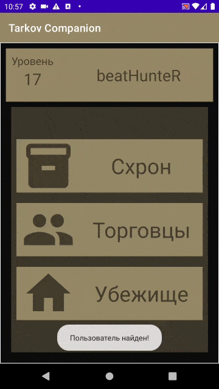

Для получения списка вещей выполняется запрос к базе данных с помощью метода `Database.getCurrentUserItemList()`

`Database.getCurrentUserItemList()`
```kotlin
public fun getCurrentUserItemList() : MutableList<Item> {
    val itemsList = mutableListOf<Item>()

    runBlocking {
        CoroutineScope(Dispatchers.IO).launch {
            val result = Database.connection.createStatement().executeQuery(
                    "SELECT id, items.name, items.type, item_count, price FROM items_in_inventories_of_all_users\n" +
                            "INNER JOIN items  on items.id = items_in_inventories_of_all_users.item_id\n" +
                            "WHERE user_id = ${Resources.CURRENT_USER_ID}"
            )
            while (result.next()) {
                val id: Int = result.getInt(1)
                val name: String = result.getString(2)
                val type: String = result.getString(3)
                val count: Int = result.getInt(4)
                val price: Int = result.getInt(5)

                itemsList.add(Item(id, name, type, price, count, false))
            }

            result.close()
        }.join()
    }

    return itemsList
}
```

На этом экране пользователь может посмотреть, какие вещи у него есть в инвентаре и проверить количество денег.

После того, как информация о предметах в инвентаре получена – она кэшируется в файл `current_items_user.json`

Если пользователь закроет Схрон и решит снова его открыть, то информация о вещах возьмется из кэш-файла, а не из базы данных. 

Возвратимся в Главное меню и перейдем в раздел «Торговцы»

#### Торговцы

На этом экране отображается основная информация о всех торговцах из базы данных – имя, текущий уровень, текущее отношение доверия.

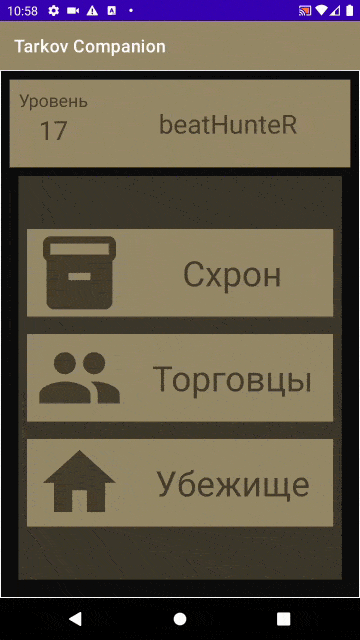

Для получения списка торговцев выполняется запрос к базе данных с помощью метода `Database.getCurrentUserTradersList()`

`Database.getCurrentUserTradersList()`
```kotlin
public fun getCurrentUserTradersList() : MutableList<Trader> {
    val tradersList = mutableListOf<Trader>()

    runBlocking {
        CoroutineScope(Dispatchers.IO).launch {
            val result = Database.connection.createStatement().executeQuery(
                    "SELECT id, traders.name, trader_level, trader_relationship_value\n" +
                            "FROM traders_of_all_users\n" +
                            "         INNER JOIN traders on traders.id = traders_of_all_users.trader_id\n" +
                            "WHERE user_id = ${Resources.CURRENT_USER_ID}"
            )
            while (result.next()) {
                val id = result.getInt(1)
                val name = result.getString(2)
                val level = result.getInt(3)
                val relationshipValue = result.getDouble(4)

                tradersList.add(Trader(id, name, level, relationshipValue))
            }
            result.close()
        }.join()
    }
    return tradersList
}
```

Выберем, например, Прапора. Попадаем на экран торговли.

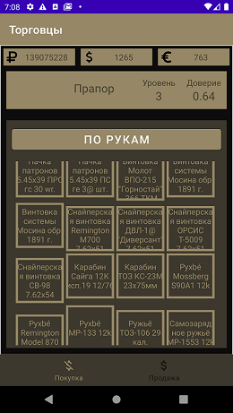


На самом верху - информация о количестве денег игрока. Ниже – информация о торговце из предыдущего экрана. Вся эта информация получена ранее и берется из класса [Resources](res/src/Resources.kt).

Определенным торговцам выдаются определенные предметы. Например, Прапор не торгует медицинскими препаратами, но зато торгует патронами и оружием, а у Терапевта не найти оружие и патроны, но зато в ассортименте у неё есть много разных медицинских препаратов и провизии.

Предметы торговцам выдаются из общей таблицы предметов `tarkov_db.items`

Для выдачи предметов торговцам выполняется запрос к базе данных с помощью `Database.getItemsListWithType()`

`Database.getItemsListWithType()`
```kotlin
public fun getItemsListWithType(type : String) : MutableList<Item> {
    val itemsList = mutableListOf<Item>()
    runBlocking {
        CoroutineScope(Dispatchers.IO).launch {
            val result = Database.connection.createStatement().executeQuery(
                    "select * from items where type = '$type'"
            )
            while (result.next()) {
                val id = result.getInt(1)
                val name = result.getString(2)
                val itemType = result.getString(3)
                val count = 1
                val price = result.getInt(4)

                val item = Item(id, name, itemType, price, count, false)
                itemsList.add(item)
            }
            result.close()
        } .join()
    }
    return itemsList
}
```
После выдачи всех нужных предметов торговцу, заполняется кэш-файл с предметами торговца `current_trader_items.json`

Если пользователь решит сначала продать предмет из своего инвентаря торговцу (перейдя при этом в раздел «Продажа»), а затем купить что-то у торговца (вернувшись в раздел «Покупка»), то информация о всех предметах торговца будет браться из кэш-файла, а не из базы данных.

Также, при переходе в раздел «Продажа», если до этого пользователь заходил в свой Схрон (а значит и заполнялся кэш-файл), то при получении вещей из инвентаря пользователя, данные берутся из кэш-файла, а не из базы данных.

##### Покупка

Попробуем купить что-нибудь у Прапора.

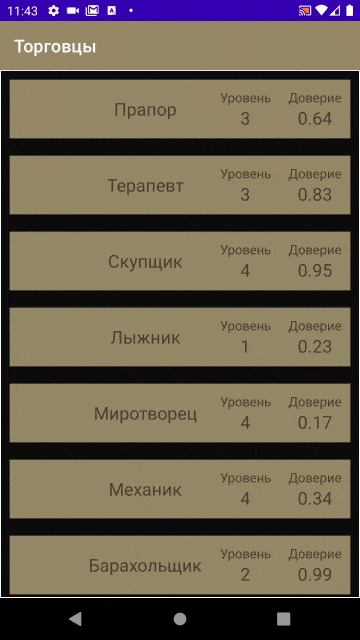

На гифке
1.	Проверяем инвентарь игрока перед покупкой. Обратим внимание на первый предмет – патрон-«Игольник»
2.	Переходим в раздел покупки и у Прапора выбираем такой же патрон-«Игольник»
3.	Покупаем предмет
4.	Видим, что у игрока в инвентаре появился еще один патрон-«Игольник», который мы купили у Прапора.

В процессе покупки предмета происходит модификация таблицы базы данных `tarkov_db.items_in_inventories_of_all_users`


Покупка выполняется с помощью метода `Database.buyItem()`

`Database.buyItem()`
```kotlin
/**
 * Inserts random item from tables.items into table for one given user
 *
 * If the user already has an item,
 * a new generated item count is added to the existing item count
 * of the existing item
 *
 * */
public fun buyItem(item : Item)  = runBlocking {

    CoroutineScope(Dispatchers.IO).launch {

        //Does item exist in use's inventory?
        var res = connection.createStatement().executeQuery(
                "select exists(" +
                        "select * from items_in_inventories_of_all_users WHERE " +
                        "user_id = ${Resources.CURRENT_USER_ID} AND " +
                        "item_id = ${item.id}" +
                        ")"
        )
        res.next()

        val isExist = res.getBoolean(1)
        if (isExist) {
            //if item exists -> increase current count of item in database
            res = connection.createStatement().executeQuery(
                    "SELECT item_count FROM items_in_inventories_of_all_users where " +
                            "user_id = ${Resources.CURRENT_USER_ID} and " +
                            "item_id = ${item.id}"
            )
            res.next()
            val curItemCount = res.getInt(1)
            val newItemCount = curItemCount + item.count
            connection.createStatement().execute(
                    "" +
                            "UPDATE items_in_inventories_of_all_users " +
                            "SET item_count = $newItemCount WHERE " +
                            "user_id =  ${Resources.CURRENT_USER_ID}  AND " +
                            "item_id = ${item.id}"
            )
        }
        else {
            //if item doesn't exist -> insert item in user's inventory
            connection.createStatement().execute(
                    "INSERT INTO items_in_inventories_of_all_users (user_id, item_id, item_count)\n" +
                            "VALUES (${Resources.CURRENT_USER_ID},\n" +
                            "        ${item.id},\n" +
                            "        ${item.count}" +
                            ")"
            )
        }

        Resources.CURRENT_USER_RUBLES_COUNT -= item.price

        connection.createStatement().execute(
                "update items_in_inventories_of_all_users\n" +
                        "set item_count = ${Resources.CURRENT_USER_RUBLES_COUNT}" +
                        "where item_id = ${Resources.ITEM_RUBLES_ID}"
        )

        res.close()
    }.join()

}
```

Также, после покупки предмета, обновляется и кэш-файл с предметами из инвентаря игрока – `current_user_items.json`

Проверим таблицу в базе данных

Я выполнил запрос, с помощью которого получил информацию о всех текущих предметах в инвентаре.

```sql
SELECT id, items.name, items.type, price, item_count FROM items_in_inventories_of_all_users
INNER JOIN items  on items.id = items_in_inventories_of_all_users.item_id
WHERE user_id = 1
```
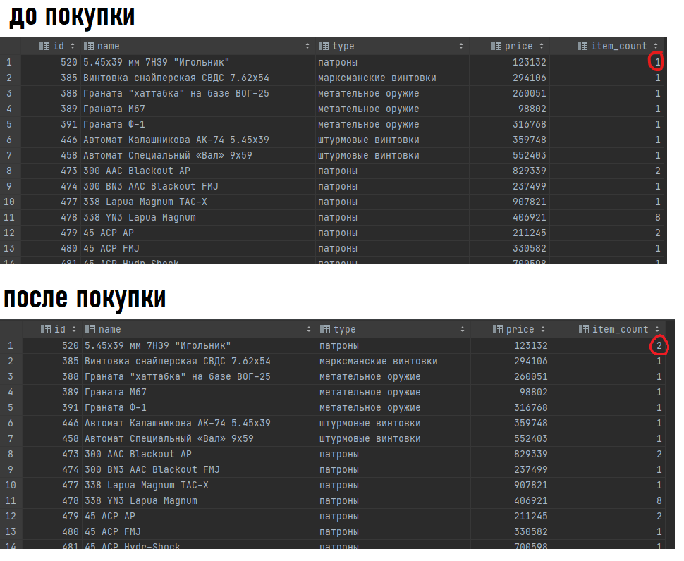

Видим, что после покупки количество «Игольников» увеличилось на 1. Все изменяется нормально.

##### Продажа

Попробуем что-нибудь продать Прапору.

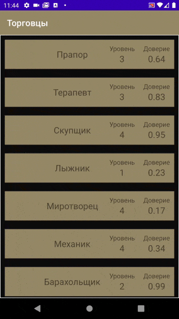

На гифке
1.	Выбираем предмет для продажи – Граната Ф-1
2.	Продаём предмет. Видим, что Граната Ф-1 пропала из инвентаря игрока после продажи.

В процессе продажи предмета происходит модификация таблицы базы данных `tarkov_db.items_in_inventories_of_all_users`. Если проданный предмет в инвентаре был последний, то строка и информацией об этом предмете полностью удаляется из таблицы. Если проданный предмет был не последний, то в строке этого предмета значение в поле `item_count` уменьшается на 1.

Продажа выполняется с помощью метода `Database.sellItem()`

`Database.sellItem()`
```kotlin
public fun sellItem(item: Item) = runBlocking {

    CoroutineScope(Dispatchers.IO).launch {
        val result = connection.createStatement().executeQuery(
                "select item_count from items_in_inventories_of_all_users\n" +
                        "where user_id = ${Resources.CURRENT_USER_ID} and " +
                        "item_id = ${item.id};"
        )

        var currentItemCount = -1
        if (result.next()) currentItemCount = result.getInt(1)


        if (currentItemCount > 1) {
            connection.createStatement().execute(
                    "update items_in_inventories_of_all_users\n" +
                            "set item_count = ${Resources.CURRENT_USER_RUBLES_COUNT}" +
                            "where user_id = ${Resources.CURRENT_USER_ID} and " +
                            "item_id = ${Resources.ITEM_RUBLES_ID}"
            )

            currentItemCount--
            connection.createStatement().execute(
                    "update items_in_inventories_of_all_users\n" +
                            "set item_count = $currentItemCount" +
                            "where user_id = ${Resources.CURRENT_USER_ID} and " +
                            "item_id = ${item.id}"
            )
        } else {
            connection.createStatement().execute(
                    "delete from items_in_inventories_of_all_users\n" +
                            "where user_id = ${Resources.CURRENT_USER_ID} and " +
                            "item_id = ${item.id}"
            )
        }

        Resources.CURRENT_USER_RUBLES_COUNT += item.price

        connection.createStatement().execute(
                "update items_in_inventories_of_all_users\n" +
                        "set item_count = ${Resources.CURRENT_USER_RUBLES_COUNT}" +
                        "where item_id = ${Resources.ITEM_RUBLES_ID}"
        )

        result.close()
    }.join()

}
```

Также, после продажи предмета, обновляется и кэш-файл с предметами из инвентаря игрока – `current_user_items.json`

Проверим таблицу в базе данных

Я выполнил запрос, с помощью которого получил информацию о всех текущих предметах в инвентаре.

```sql
SELECT id, items.name, items.type, price, item_count FROM items_in_inventories_of_all_users
INNER JOIN items  on items.id = items_in_inventories_of_all_users.item_id
WHERE user_id = 1
```

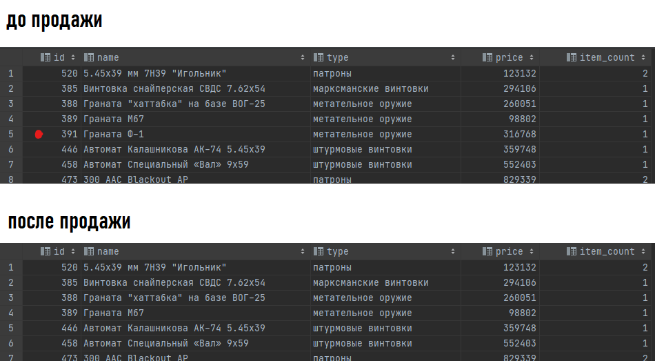

Видим, что после продажи Гранаты Ф-1, строка с информацией о ней удалилась из таблицы. Все изменяется нормально.

#### Убежище

Вернёмся в главное меню и перейдем в Убежище игрока.

В убежище отображается информация о каждой, имеющейся у игрока, постройке: её название и уровень.

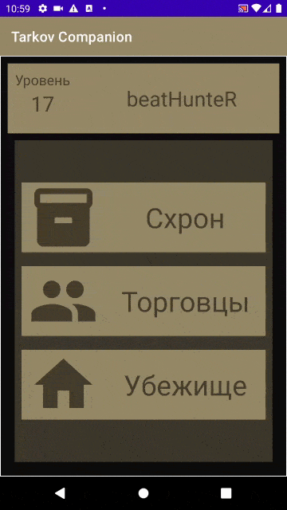

Для получения списка построек выполняется запрос к БД с помощью метода `Database.getCurrentUserBuildingsList()`

`Database.getCurrentUserBuildingsList()`
```kotlin
public fun getCurrentUserBuildingsList() : MutableList<Building> {

    val buildingsList = mutableListOf<Building>()

    runBlocking {
        CoroutineScope(Dispatchers.IO).launch {
            val result = Database.connection.createStatement().executeQuery(
                    "SELECT buildings.name, buildings.level\n" +
                            "FROM buildings_in_all_users_sanctuaries\n" +
                            "         INNER JOIN buildings on buildings.id = buildings_in_all_users_sanctuaries.building_id\n" +
                            "WHERE user_id = ${Resources.CURRENT_USER_ID}\n" +
                            "ORDER BY name"
            )

            while (result.next()) {

                val buildingName = result.getString(1)
                val buildingLevel = result.getInt(2)

                buildingsList.add(Building(buildingName, buildingLevel))
            }

            result.close()

        }.join()
    }

    return buildingsList
}
```

##### Постройка и её улучшение

Выберем постройку «Зона отдыха».

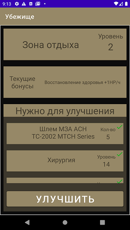

На этом экране отображается вся информация о текущей выбранной постройке: название, текущий уровень, текущие бонусы, которые даёт постройка, требования, которые нужны для улучшения.

Название и уровень постройки берутся из констант класса [Resources](res/src/Resources.kt), а текущие бонусы и требования для улучшения берутся из БД в результате запроса с помощью метода `Database.getInfoAboutSeletedBuilding()`

`Database.getInfoAboutSeletedBuilding()`
```kotlin
public fun getInfoAboutSelectedBuilding(
        requirementsList: MutableList<Requirement>,
        curBonuses: String,
        reqId: Int,
        view: View) {
    var currentBonuses = curBonuses
    var requirementId = reqId

    runBlocking {
        CoroutineScope(Dispatchers.IO).launch {

            var result = Database.connection.createStatement().executeQuery(
                    "SELECT buildings.id, buildings.name, buildings.level, improvements.future_bonuses, improvements.requirement_id\n" +
                            "FROM buildings\n" +
                            "    INNER JOIN improvements ON improvements.id = buildings.improvement_id\n" +
                            "WHERE name = '${Resources.CURRENT_BUILDING_NAME}' " +
                            "AND level = ${Resources.CURRENT_BUILDING_LEVEL}"
            )

            if (result.next()) {
                Resources.CURRENT_BUILDING_ID = result.getInt(1)
                currentBonuses = result.getString(4)
                requirementId = result.getInt(5)
            }
            if (currentBonuses == "null") currentBonuses = "Нет"

            result = Database.connection.createStatement().executeQuery(
                    "SELECT requirements.id, items.name, item_count, skills.name, skill_level, traders.name, trader_level FROM requirements\n" +
                            "    LEFT JOIN items ON items.id = requirements.item_id\n" +
                            "    LEFT JOIN skills ON skills.id = requirements.skill_id\n" +
                            "    LEFT JOIN traders ON traders.id = requirements.trader_id\n" +
                            "WHERE requirements.id = $requirementId"
            )

            if (result.next()) {
                //если в требовании есть предмет
                if (result.getString(2) != "null") {
                    requirementsList.add(
                            Requirement(result.getString(2), result.getInt(3), 1, false)
                    )
                }
                //если в требовании есть навык
                if (result.getString(4) != "null") {
                    requirementsList.add(
                            Requirement(result.getString(4), result.getInt(5), 2, false)
                    )
                }
                //если в требовании есть торговец
                if (result.getString(6) != "null") {
                    requirementsList.add(
                            Requirement(result.getString(6), result.getInt(7), 3, false)
                    )
                }
            }


            //filling user's items list
            result = Database.connection.createStatement().executeQuery(
                    "SELECT id, items.name, items.type, price, item_count FROM items_in_inventories_of_all_users\n" +
                            "INNER JOIN items  on items.id = items_in_inventories_of_all_users.item_id\n" +
                            "WHERE user_id = ${Resources.CURRENT_USER_ID}\n"
            )

            while (result.next()) {
                val id = result.getInt(1)
                val name = result.getString(2)
                val type = result.getString(3)
                val price = result.getInt(4)
                val count = result.getInt(5)
                Resources.CURRENT_USER_ITEMS_LIST.add(
                        Item(id, name, type, price, count, false)
                )
            }

            //filling user's traders list
            result = Database.connection.createStatement().executeQuery(
                    "SELECT trader_id, traders.name, trader_level, trader_relationship_value\n" +
                            "FROM traders_of_all_users\n" +
                            "         INNER JOIN traders on traders.id = traders_of_all_users.trader_id\n" +
                            "WHERE user_id = ${Resources.CURRENT_USER_ID};"
            )

            while (result.next()) {
                val id = result.getInt(1)
                val name = result.getString(2)
                val level = result.getInt(3)
                val relationshipValue = result.getDouble(4)
                Resources.CURRENT_USER_TRADERS_LIST.add(
                        Trader(id, name, level, relationshipValue)
                )
            }

            //filling user's skills list
            result = Database.connection.createStatement().executeQuery(
                    "SELECT skill_id, skills.name, skill_level, skill_value\n" +
                            "FROM skills_of_all_users\n" +
                            "         INNER JOIN skills on skills.id = skills_of_all_users.skill_id\n" +
                            "WHERE user_id = ${Resources.CURRENT_USER_ID};"
            )

            while (result.next()) {
                val id = result.getInt(1)
                val name = result.getString(2)
                val level = result.getInt(3)
                val value = result.getDouble(4)
                Resources.CURRENT_USER_SKILLS_LIST.add(
                        Skill(id, name, level, value)
                )
            }

            result.close()
        }.join()

        view.current_bonuses_text.text = currentBonuses
    }

}
```

На скриншоте видно, что для улучшения Зоны отдыха готовы все требования. Попробуем улучшить постройку.

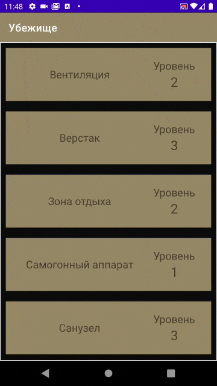

Видим, что постройка успешно улучшилась, при этом обновился её уровень, текущие бонусы и требования для нового улучшения.

В процессе улучшения происходит модификация таблицы `tarkov_db. buildings_in_all_users_sanctuaries`, а также таблицы `tarkov_db.items_in_inventories_of_all_users`, так как из инвентаря игрока нужно удалить предметы, которые понадобились при улучшении.

Улучшение выполняется с помощью метода `Database.improveBuilding()`
`Database.improveBuilding()`
```kotlin
public fun improveBuilding(
        requirementsList : MutableList<Requirement>,
        curBonuses : String,
        reqId : Int,
        view : View) {

    var currentBonuses = curBonuses
    var requirementId = reqId

    var isAllRequirementsReady = true
    for (requirement in requirementsList) {
        if (!requirement.isReady) isAllRequirementsReady = false
    }
    if (isAllRequirementsReady) {
        runBlocking {
            CoroutineScope(Dispatchers.IO).launch {

                var result: ResultSet

                for (requirement in requirementsList) {
                    if (requirement.type == Requirement.TYPE_ITEM) {
                        val itemName = requirement.name
                        result = Database.connection.createStatement().executeQuery(
                                "SELECT id, items.name, items.type, price, item_count FROM items_in_inventories_of_all_users\n" +
                                        "INNER JOIN items  on items.id = items_in_inventories_of_all_users.item_id\n" +
                                        "WHERE user_id = ${Resources.CURRENT_USER_ID} and\n" +
                                        "        items.name = '$itemName'"
                        )
                        result.next()
                        val id = result.getInt(1)
                        val name = result.getString(2)
                        val type = result.getString(3)
                        val price = result.getInt(4)
                        val count = result.getInt(5)
                        val curItem = Item(id, name, type, price, count, false)
                        if (curItem.count != -1) {
                            if (curItem.count - requirement.value >= 1) {
                                val newItemCount = curItem.count - requirement.value
                                Database.connection.createStatement().execute(
                                        "UPDATE items_in_inventories_of_all_users " +
                                                "SET item_count = $newItemCount WHERE " +
                                                "user_id = ${Resources.CURRENT_USER_ID}  AND " +
                                                "item_id = ${curItem.id}"
                                )
                            } else {
                                Database.connection.createStatement().execute(
                                        "delete from items_in_inventories_of_all_users\n" +
                                                "where user_id = ${Resources.CURRENT_USER_ID} and " +
                                                "item_id = ${curItem.id}"
                                )
                            }
                        }

                    }
                }
                Database.connection.createStatement().execute(
                        "delete from buildings_in_all_users_sanctuaries\n" +
                                "    where user_id = ${Resources.CURRENT_USER_ID} and " +
                                "building_id = ${Resources.CURRENT_BUILDING_ID}"
                )

                result = Database.connection.createStatement().executeQuery(
                        "select id from buildings\n" +
                                "where name = '${Resources.CURRENT_BUILDING_NAME}' and\n" +
                                "      level = ${Resources.CURRENT_BUILDING_LEVEL + 1}"
                )
                result.next()
                val nextBuildingId = result.getInt(1)
                Database.connection.createStatement().execute(
                        "insert into buildings_in_all_users_sanctuaries (user_id, building_id) \n" +
                                "values (${Resources.CURRENT_USER_ID}, $nextBuildingId)"
                )

                Resources.CURRENT_BUILDING_ID = nextBuildingId
                Resources.CURRENT_BUILDING_LEVEL++

                result.close()
            }.join()

            requirementsList.clear()

            view.building_name.text = Resources.CURRENT_BUILDING_NAME
            view.building_level_val.text = Resources.CURRENT_BUILDING_LEVEL.toString()

            runBlocking {
                CoroutineScope(Dispatchers.IO).launch {

                    var result = Database.connection.createStatement().executeQuery(
                            "SELECT buildings.id, buildings.name, buildings.level, improvements.future_bonuses, improvements.requirement_id\n" +
                                    "FROM buildings\n" +
                                    "    INNER JOIN improvements ON improvements.id = buildings.improvement_id\n" +
                                    "WHERE name = '${Resources.CURRENT_BUILDING_NAME}' " +
                                    "AND level = ${Resources.CURRENT_BUILDING_LEVEL}"
                    )

                    if (result.next()) {
                        Resources.CURRENT_BUILDING_ID = result.getInt(1)
                        currentBonuses = result.getString(4)
                        requirementId = result.getInt(5)
                    }
                    if (currentBonuses == "null") currentBonuses = "Нет"

                    result = Database.connection.createStatement().executeQuery(
                            "SELECT requirements.id, items.name, item_count, skills.name, skill_level, traders.name, trader_level FROM requirements\n" +
                                    "    LEFT JOIN items ON items.id = requirements.item_id\n" +
                                    "    LEFT JOIN skills ON skills.id = requirements.skill_id\n" +
                                    "    LEFT JOIN traders ON traders.id = requirements.trader_id\n" +
                                    "WHERE requirements.id = $requirementId"
                    )

                    if (result.next()) {
                        //если в требовании есть предмет
                        if (result.getString(2) != "null") {
                            requirementsList.add(
                                    Requirement(result.getString(2), result.getInt(3), 1, false)
                            )
                        }
                        //если в требовании есть навык
                        if (result.getString(4) != "null") {
                            requirementsList.add(
                                    Requirement(result.getString(4), result.getInt(5), 2, false)
                            )
                        }
                        //если в требовании есть торговец
                        if (result.getString(6) != "null") {
                            requirementsList.add(
                                    Requirement(result.getString(6), result.getInt(7), 3, false)
                            )
                        }
                    }

                    Resources.CURRENT_USER_ITEMS_LIST.clear()
                    //filling user's items list
                    result = Database.connection.createStatement().executeQuery(
                            "SELECT id, items.name, items.type, price, item_count FROM items_in_inventories_of_all_users\n" +
                                    "INNER JOIN items  on items.id = items_in_inventories_of_all_users.item_id\n" +
                                    "WHERE user_id = ${Resources.CURRENT_USER_ID}\n"
                    )

                    while (result.next()) {
                        val id = result.getInt(1)
                        val name = result.getString(2)
                        val type = result.getString(3)
                        val price = result.getInt(4)
                        val count = result.getInt(5)
                        Resources.CURRENT_USER_ITEMS_LIST.add(
                                Item(id, name, type, price, count, false)
                        )
                    }

                    result.close()
                }.join()
            }


            view.current_bonuses_text.text = currentBonuses
            val requirementsRV = view.requirements_rv
            requirementsRV.layoutManager = LinearLayoutManager(Resources.CURRENT_ACTIVITY)
            requirementsRV.adapter = RequirementsAdapter(view, requirementsList)
        }
    }
    else {
        Toast.makeText(Resources.CURRENT_ACTIVITY, "Не все требования выполнены!", Toast.LENGTH_SHORT).show()
    }
}
```

Теперь проверим таблицу в базе данных. Чтобы посмотреть все постройки текущего пользователя, я воспользовался запросом из 1ого Индивидуального задания 3ей Лабораторной работы.

```sql
SELECT buildings.name, buildings.level
FROM buildings_in_all_users_sanctuaries
        INNER JOIN buildings on buildings.id = buildings_in_all_users_sanctuaries.building_id
        WHERE user_id = (SELECT id from users where nickname = 'beatHunteR')
ORDER BY name;
```

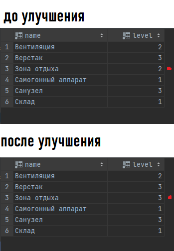

Видим, что в таблице уровень Зоны отдыха увеличился на 1. Все изменяется нормально.

### Использование кэш-файлов

Как я упомянул ранее, в приложении используются 2 кэш-файла:
1.	Кэш-файл для инвентаря пользователя – `current_user_items.json`
2.	Кэш-файл для предметов последнего открытого торговца – `current_trader_items.json`

Для сравнения я реализовал класс [Statistics](res/src/Statistics.kt)

В нём рассчитывается математическое ожидание, дисперсия, среднеквадратическое отклонение. Коэффициент Стьюдента = 2.13 (при *p* = 0.9 и *n* = 5)

`Statistics`
```kotlin
import java.math.BigDecimal
import java.math.RoundingMode
import kotlin.math.pow
import kotlin.math.sqrt

class Statistics {


    public fun calculate(xList: List<Double>) {
        val M = calculateExpectedValue(xList)
        val D = calculateDispersion(xList, M)
        val S = calculateDeviation(D)
        val avgS = S / sqrt(xList.size.toDouble())
        val student = 2.13
        val delta : Double = student * avgS

        val MBD = BigDecimal(M).setScale(2, RoundingMode.HALF_EVEN)
        val deltaBD = BigDecimal(delta).setScale(2, RoundingMode.HALF_EVEN)
        print("Результат при \t X : $xList\n" +
                "\tM: $MBD\n" +
                "\tD: $D\n" +
                "\tS: $S\n" +
                "\tavgS : $avgS\n" +
                "\tstudent : $student\n" +
                "\tdelta: $deltaBD\n" +
                "\n" +
                "$MBD +- $deltaBD\n\n")
    }


    private fun calculateExpectedValue(xList : List<Double>) : Double {
        var sum = 0.0
        for (x in xList) sum += x
        return sum / xList.size
    }


    private fun calculateDispersion(xList : List<Double>, M : Double) : Double {
        var sum = 0.0
        for (x in xList) sum += (x - M).pow(2)

        return (1.0 / (xList.size - 1.0)) * sum
    }

    private fun calculateDeviation(D : Double) : Double {
        return sqrt(D)
    }

}
```

Посмотрим, как использование кэш-файлов влияет на время выполнения программы.

**Сценарий открытия схрона игрока** (прогрузка всех предметов игрока)
|        | Время          |
| ------------- |:-------------:|
| Запрос     |7.80 мс ± 0.80 мс |
| Использование кэша     | 8.40 мс ± 1.09 мс     |

Время зависит от количества предметов в схроне. Я проводил эксперимент с количеством предметов в схроне = 56. Видно, что при маленьком количестве предметов нет большой разницы между обращением к БД и к кэшу.

Исходные данные эксперимента и результаты
```
Схрон | Запрос
Результат при 	 X : [8.0, 9.0, 7.0, 8.0, 7.0]
	M: 7.80
	D: 0.7
	S: 0.8366600265340756
	avgS : 0.3741657386773941
	student : 2.13
	delta: 0.80

7.80 +- 0.80

Схрон | Кэш
Результат при 	 X : [8.0, 10.0, 7.0, 9.0, 8.0]
	M: 8.40
	D: 1.2999999999999998
	S: 1.1401754250991378
	avgS : 0.5099019513592784
	student : 2.13
	delta: 1.09

8.40 +- 1.09
```

**Сценарий открытия экрана торговца** (прогрузка всех предметов торговца)
|        | Время          |
| ------------- |:-------------:|
| Запрос     |509.40 мс ± 89.60 мс |
| Использование кэша     | 66.40 мс ± 30.57 мс     |

Время также зависит от количества предметов у торговца. Я проводил эксперимент на Прапоре, у которого количество предметов = 268. Видим огромную разницу в выполнении с использованием кэша и без. 

Исходные данные эксперимента и результаты
```
Торговец | Запрос
Результат при 	 X : [644.0, 531.0, 413.0, 533.0, 426.0]
	M: 509.40
	D: 8847.300000000001
	S: 94.06008717835637
	avgS : 42.06494978007224
	student : 2.13
	delta: 89.60

509.40 +- 89.60

Торговец | Кэш
Результат при 	 X : [121.0, 68.0, 55.0, 45.0, 43.0]
	M: 66.40
	D: 1029.8
	S: 32.09049703572695
	avgS : 14.35130656072819
	student : 2.13
	delta: 30.57

66.40 +- 30.57
```

Также можно отметить, что при увеличении числа предметов у игрока, будет такое же увеличение времени и такая же зависимость между обращением к БД и к кэшу.

### Другой пользователь

Пользователь же не может быть один на всю систему. Попробуем авторизироваться за другого пользователя.

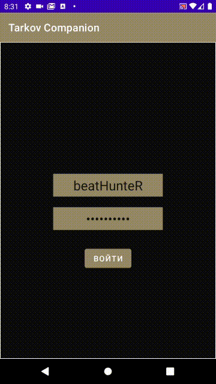

Видим полностью другую информацию
1.	Другой уровень
2.	Другие вещи в схроне
3.	Другие уровни у торговцев и другие уровни доверия
4.	Другие постройки в убежище

Таким образом и происходит организация прав доступа и разделение информации из базы данных между разными пользователями.


### Полная работа приложения

На следующей гифке можно пронаблюдать полный функционал приложения


## Вывод

В результате выполнения курсовой работы реализовано Android приложение-компаньон для игры Escape From Tarkov. Пользователь может просматривать предметы в своем схроне, покупать предметы у торговцев, продавать предметы торговцам, улучшать постройки в своём убежище. 

Получены навыки взаимодействия клиента с базой данный PostgreSQL с использованием плагина JDBC. В процессе работы клиент подключался к базе данных, расположенной локально на моем компьютере.

Также закреплены навыки использования SQL-запросов, использование файлового кэша в приложении. При помощи кэша можно значительно ускорить работу своего приложения. В результате проведенных экспериментов выяснено, что при большом количестве кэшируемой информации (предметов у игрока/торговца) достигается увеличение времени выполнения чуть ли не в 10 раз. При малом количестве кэшируемой информации разница между запросом к БД и запросом к кэшу минимальна и незначительна.

В будущем планируется доработка приложения и введение новых функций.
